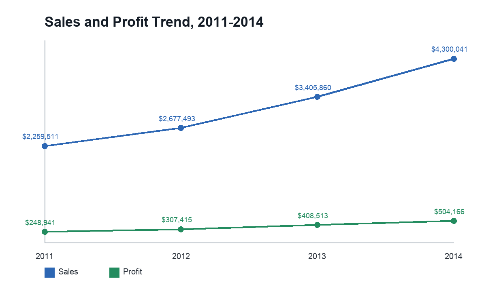
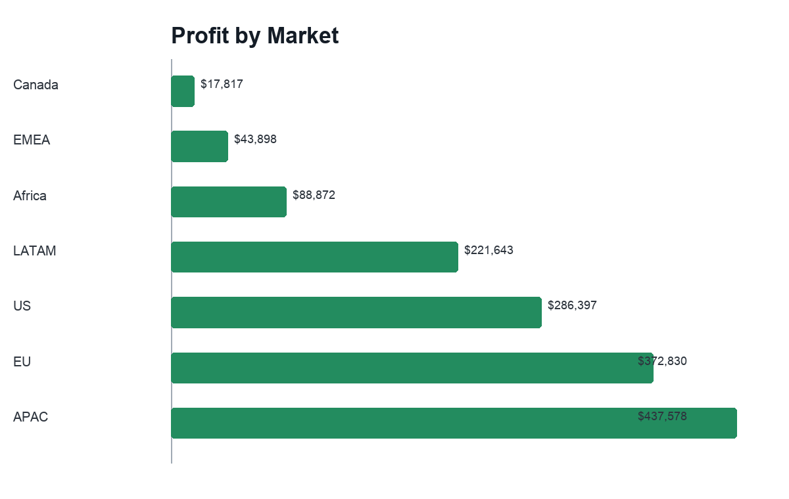
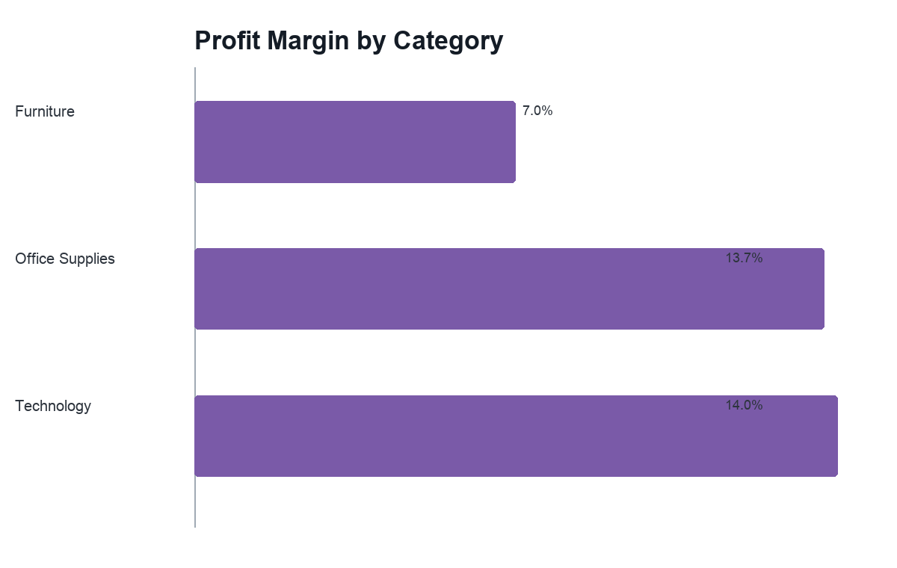
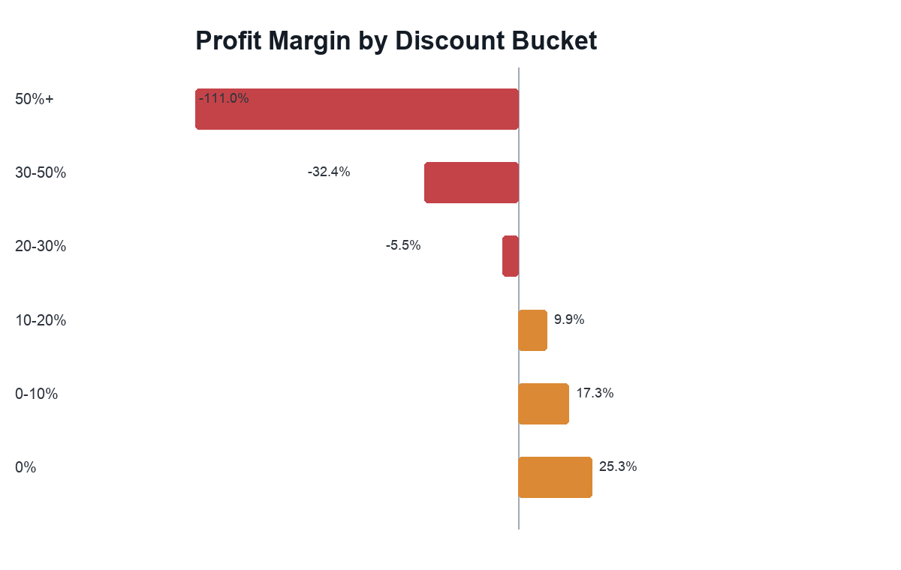
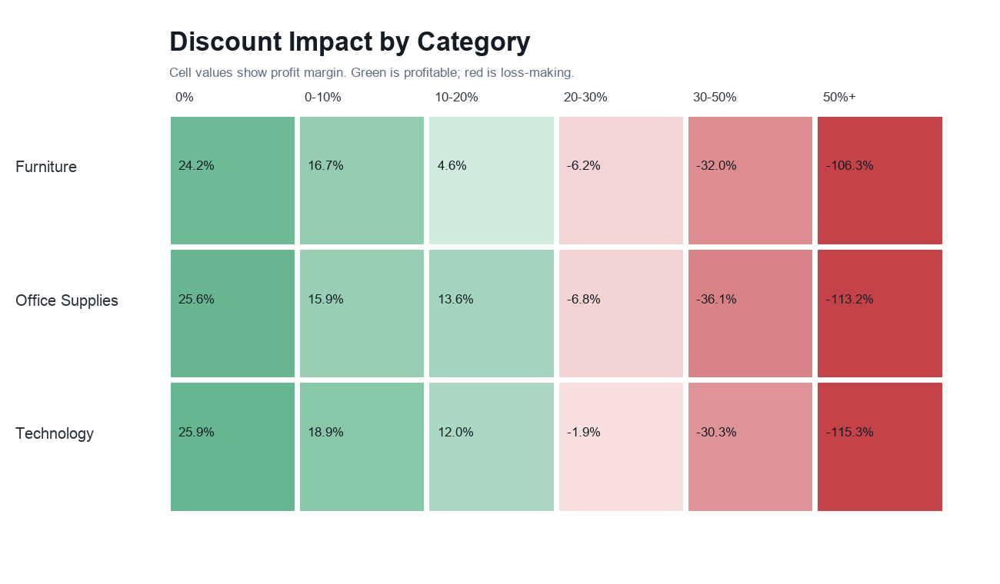
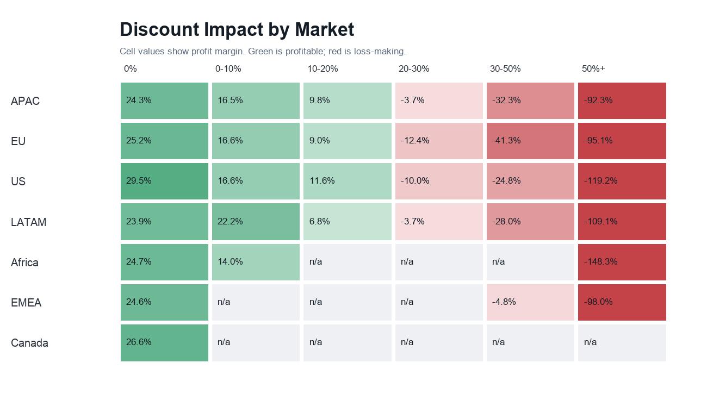

# SuperStore Sales Performance Analysis

Portfolio project analyzing Global Superstore sales performance from 2011 to 2014.

## Project Objective

Identify which markets, categories, and discount policies generate profit, and where the business loses money. The analysis is designed to support decisions on discount discipline, product strategy, and regional priorities.

## Data

Source file: `SuperStoreOrders.csv`

Dataset size:

- 51,290 rows
- 25,035 orders
- 795 customers
- Period: 2011-2014
- Markets: APAC, EU, US, LATAM, Africa, EMEA, Canada

The dataset has no missing values and no fully duplicated rows. The `sales` field was cleaned by removing thousands separators and converting it to numeric format. Dates were parsed with mixed-format, day-first logic because the file contains both `/` and `-` date separators.

## Tools

- Python
- pandas
- Pillow for lightweight chart generation
- LaTeX / XeLaTeX for the PDF report

## Final Report

PDF analytical report: [`reports/superstore_sales_report.pdf`](reports/superstore_sales_report.pdf)

LaTeX source: [`reports/superstore_sales_report.tex`](reports/superstore_sales_report.tex)

Interactive dashboard: [`dashboard/index.html`](dashboard/index.html)

Customer and product profitability deep dive: [`customer_product_analysis/README.md`](customer_product_analysis/README.md)

Customer/product PDF report: [`customer_product_analysis/customer_product_profitability_report.pdf`](customer_product_analysis/customer_product_profitability_report.pdf)

## Key Metrics

| Metric | Value |
|---|---:|
| Sales | $12,642,905 |
| Profit | $1,469,035 |
| Profit margin | 11.6% |
| Average discount | 14.3% |
| Loss-making rows | 12,543 |
| Loss-making row share | 24.5% |

## Main Findings

### 1. Sales and profit are growing, but margin remains constrained

Sales increased from $2.26M in 2011 to $4.30M in 2014. Profit also increased, from $249K to $504K. However, overall profit margin across the period is 11.6%, which means revenue growth does not fully convert into profit.



### 2. APAC, EU, and the US generate the largest profit

Most profitable markets:

- APAC: $438K profit
- EU: $373K profit
- US: $286K profit

Canada has the highest profit margin at 26.6%, but its sales base is small. EMEA is a weak market, generating only $44K in profit at a 5.4% margin.



### 3. Furniture needs closer attention

Technology and Office Supplies show similar margins: 14.0% and 13.7%. Furniture is materially weaker at 7.0%. The main issue inside Furniture is the Tables sub-category, which generated a $64K loss.



### 4. High discounts destroy profitability

Orders without discounts have a 25.3% profit margin. At 20-30% discounts, margin already turns negative at -5.5%. At discounts above 50%, losses become severe, with a -111.0% profit margin. This chart is calculated across the full dataset: all markets, countries, categories, segments, and years.



The category and market breakdowns confirm that this is not driven by one isolated segment. Every major category turns loss-making in the 20-30% discount bucket, and the same threshold appears across APAC, EU, US, and LATAM.





### 5. Losses are concentrated in countries with high discounts

Largest loss-making countries:

- Turkey: -$98K profit, 60% average discount
- Nigeria: -$81K profit, 70% average discount
- Netherlands: -$41K profit, 48% average discount

This points to a commercial policy issue, not only a demand issue.

## Recommendations

1. Cap discounts above 20%, especially in markets and categories with negative margins.
2. Review the Tables strategy, including pricing, discount rules, logistics, and product mix.
3. Scale proven practices from APAC, EU, and the US because these markets generate the largest absolute profit.
4. Audit EMEA, Turkey, and Nigeria at the pricing and promotional-policy level.
5. Use Canada as a profitability benchmark, but not as the main growth driver because of its small sales base.

## Interactive Dashboard

The project also includes a static browser dashboard with filters for year, market, and category. It summarizes sales, profit, profit margin, order lines, loss-making row share, market contribution, category margin, discount impact, country losses, and weakest products.

Open locally:

```text
dashboard/index.html
```

## Customer and Product Deep Dive

The third analysis looks at customer and product profitability, including top and bottom customers, top and bottom products, ABC/Pareto analysis, and segment-level margins.

Open the case study:

```text
customer_product_analysis/README.md
```

Open the PDF report:

```text
customer_product_analysis/customer_product_profitability_report.pdf
```

## Project Structure

```text
.
├── SuperStoreOrders.csv
├── README.md
├── requirements.txt
├── dashboard
│   ├── app.js
│   ├── data.js
│   ├── index.html
│   └── styles.css
├── customer_product_analysis
│   ├── README.md
│   ├── customer_product_profitability_report.pdf
│   ├── customer_product_profitability_report.tex
│   ├── charts
│   └── tables
├── reports
│   ├── superstore_sales_report.pdf
│   └── superstore_sales_report.tex
├── scripts
│   ├── analyze_superstore.py
│   ├── build_dashboard_data.py
│   └── customer_product_analysis.py
└── outputs
    ├── charts
    │   ├── margin_by_category.png
    │   ├── margin_by_discount.png
    │   ├── discount_impact_by_category.png
    │   ├── discount_impact_by_market.png
    │   ├── profit_by_market.png
    │   └── sales_profit_trend.png
    └── tables
        ├── category_performance.csv
        ├── country_losses.csv
        ├── discount_by_category.csv
        ├── discount_by_market.csv
        ├── discount_performance.csv
        ├── market_performance.csv
        ├── product_losses.csv
        ├── region_performance.csv
        ├── segment_performance.csv
        ├── subcategory_performance.csv
        ├── summary_metrics.csv
        └── yearly_performance.csv
```

## How to Run

```bash
python scripts/analyze_superstore.py
```

The script regenerates summary tables and charts in the `outputs/` folder.

To regenerate the dashboard data:

```bash
python scripts/build_dashboard_data.py
```

To regenerate the customer and product deep dive:

```bash
python scripts/customer_product_analysis.py
```
