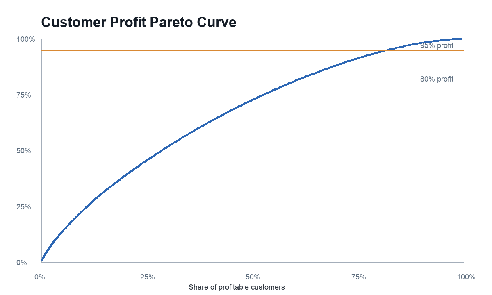
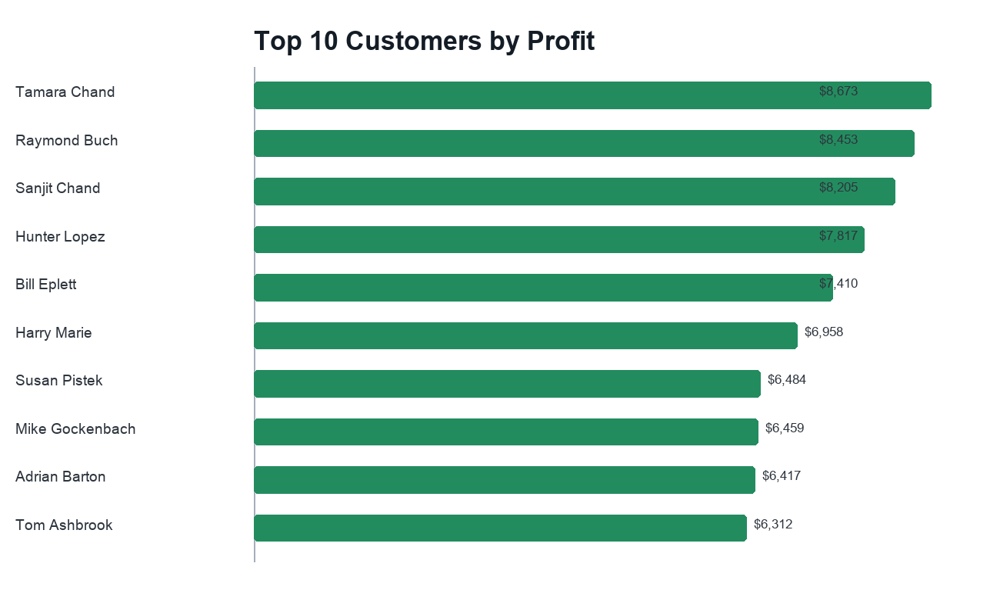
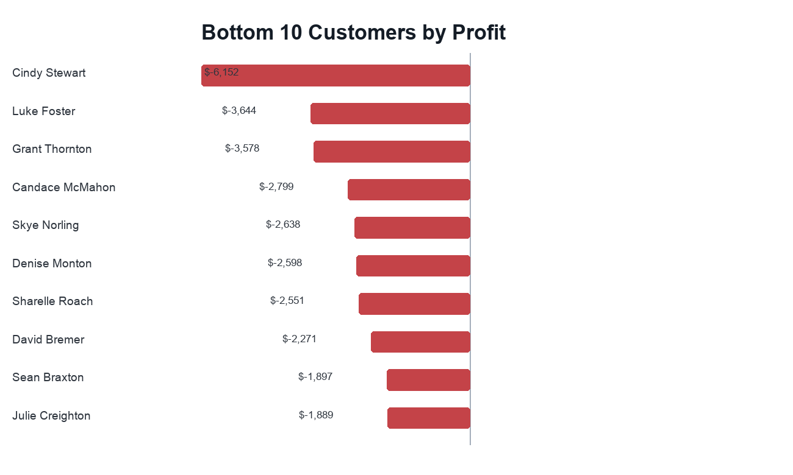
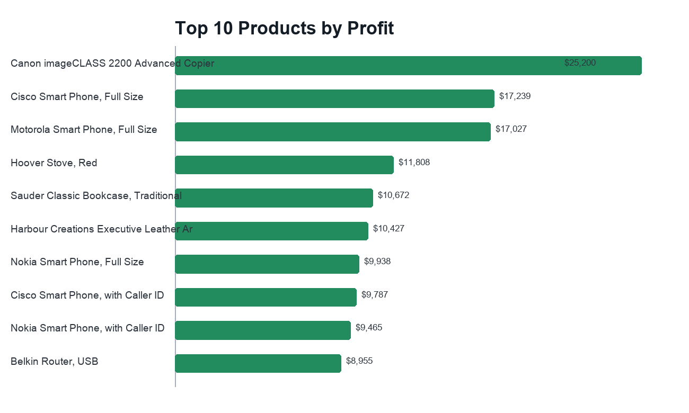
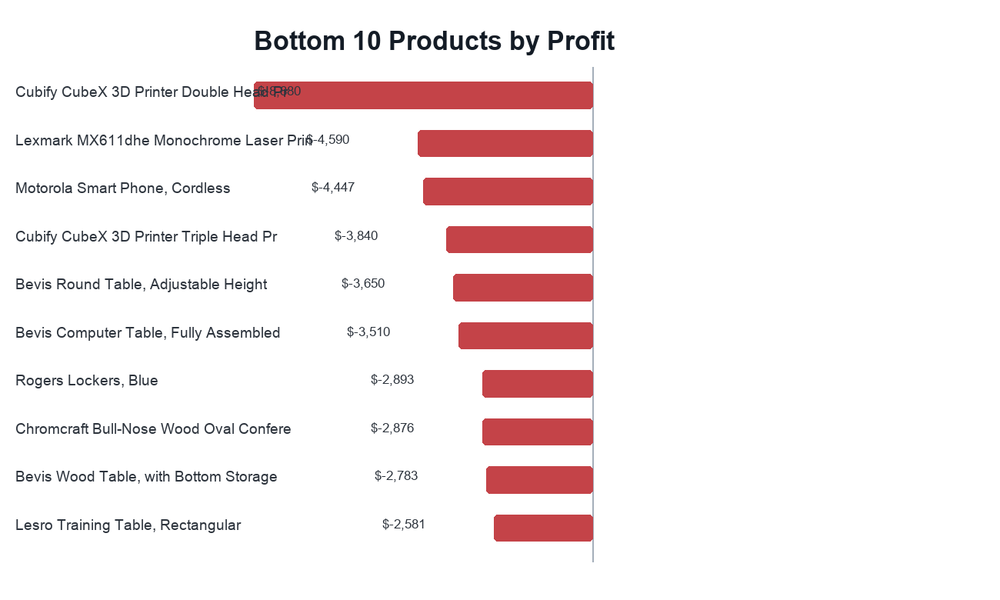

# Customer and Product Profitability Analysis

This portfolio case extends the SuperStore sales analysis with a deeper look at customer and product profitability.

PDF report: [`customer_product_profitability_report.pdf`](customer_product_profitability_report.pdf)

LaTeX source: [`customer_product_profitability_report.tex`](customer_product_profitability_report.tex)

Interactive dashboard: [`dashboard/index.html`](dashboard/index.html)

## Business Question

Which customers and products create the most profit, which ones destroy margin, and how concentrated is profit across the customer base?

## Key Findings

### 1. Profit is broad, not extremely concentrated

The dataset contains 795 customers. The top 427 profitable customers generate 80% of positive customer profit. This means profit is meaningful across a wide customer base rather than being driven by only a handful of accounts.



ABC summary:

| Class | Customers | Sales | Profit |
|---|---:|---:|---:|
| A | 427 | $7,589,112 | $1,227,368 |
| B | 169 | $2,343,587 | $229,796 |
| C | 132 | $1,761,355 | $77,384 |
| Loss | 67 | $948,851 | -$65,513 |

### 2. The most profitable customers combine scale and margin

Top customers are not just high-sales customers. They also keep strong profit margins and moderate discount levels.



Top examples:

- Tamara Chand: $8.7K profit, 23.2% margin
- Raymond Buch: $8.5K profit, 28.6% margin
- Sanjit Chand: $8.2K profit, 30.9% margin

### 3. Loss-making customers should be reviewed individually

There are 67 customers with negative total profit. The largest loss-making customer is Cindy Stewart with -$6.2K profit and -45.8% margin.



These customers are not automatically bad accounts, but they should be reviewed for discounting, product mix, and delivery economics.

### 4. Product losses are concentrated in specific items

The most profitable products are mostly Technology items such as copiers, phones, and routers.



The weakest products include 3D printers, machines, and several table products.



Examples:

- Cubify CubeX 3D Printer Double Head Print: -$8.9K profit, -80.0% margin
- Lexmark MX611dhe Monochrome Laser Printer: -$4.6K profit, -27.3% margin
- Bevis Round Table, Adjustable Height: -$3.6K profit, -64.5% margin

### 5. Segment margins are similar

Customer segment is less important than product mix and discount behavior. Consumer, Corporate, and Home Office all have profit margins around 11.5-12.0%.

| Segment | Sales | Profit | Profit margin |
|---|---:|---:|---:|
| Consumer | $6,508,141 | $749,240 | 11.5% |
| Corporate | $3,824,808 | $442,786 | 11.6% |
| Home Office | $2,309,956 | $277,009 | 12.0% |

## Recommendations

1. Protect high-profit customers with targeted retention and service quality.
2. Review the 67 loss-making customers before expanding discounts or promotions to them.
3. Investigate high-loss products, especially 3D printers, machines, and tables.
4. Use customer profitability, not sales alone, as the primary account-prioritization metric.
5. Keep segment-level strategy broad, but manage discounting and product mix at customer/product level.

## Outputs

Dashboard:

- `dashboard/index.html`
- `dashboard/app.js`
- `dashboard/data.js`
- `dashboard/styles.css`

Tables:

- `tables/customer_profitability.csv`
- `tables/top_customers.csv`
- `tables/bottom_customers.csv`
- `tables/product_profitability.csv`
- `tables/top_products.csv`
- `tables/bottom_products.csv`
- `tables/segment_profitability.csv`
- `tables/abc_summary.csv`

Charts:

- `charts/customer_profit_pareto.png`
- `charts/top_customers_profit.png`
- `charts/bottom_customers_profit.png`
- `charts/top_products_profit.png`
- `charts/bottom_products_profit.png`

## How to Reproduce

```bash
python scripts/customer_product_analysis.py
```
